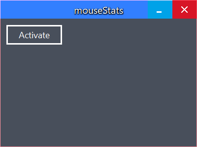
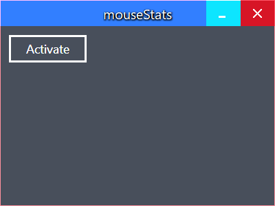

# mouseStats

> A way to track your mouse. Literally.

# Progress

The project is currently under heavy development. The goal is to try a new way of creating
sublime user interfaces by using borderless windows:

### Borderless window

### Close button highlighted:

### Minimize button highlighted:

The app should also be DPI-aware and use fluid design.

# License

This project uses the MIT license.
