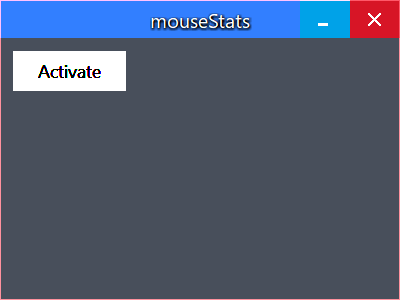

# mouseStats

> A way to track your mouse. Literally.

# Progress

The project is currently under heavy development. The goal is to try a new way (at least new to me)
of creating sublime user interfaces by using borderless windows:

### Borderless window including a metro-style button

### Close button highlighted:

### Minimize button highlighted:

### Metro-style button highlighted:

### Metro-style button pressed:

The app should also be DPI-aware and use fluid design.

# License

This project uses the MIT license.

# Credits

Mouse icon: 
<a href="https://www.flaticon.com/free-icons/cursor" title="cursor icons">Cursor icons created by Freepik - Flaticon</a>

Statistics icon: 
<a href="https://www.flaticon.com/free-icons/statistics" title="statistics icons">Statistics icons created by srip - Flaticon</a>
